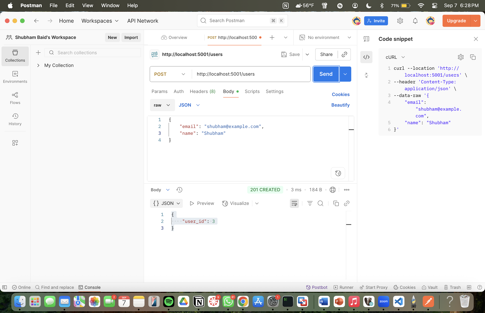
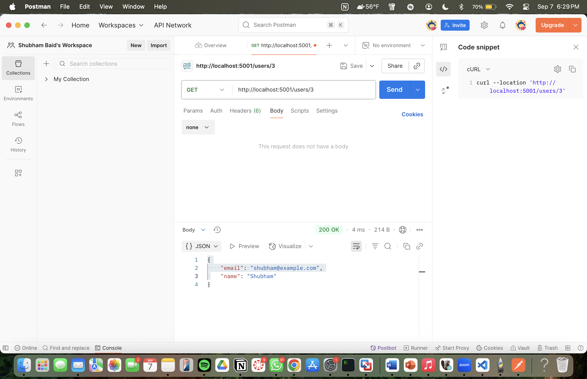
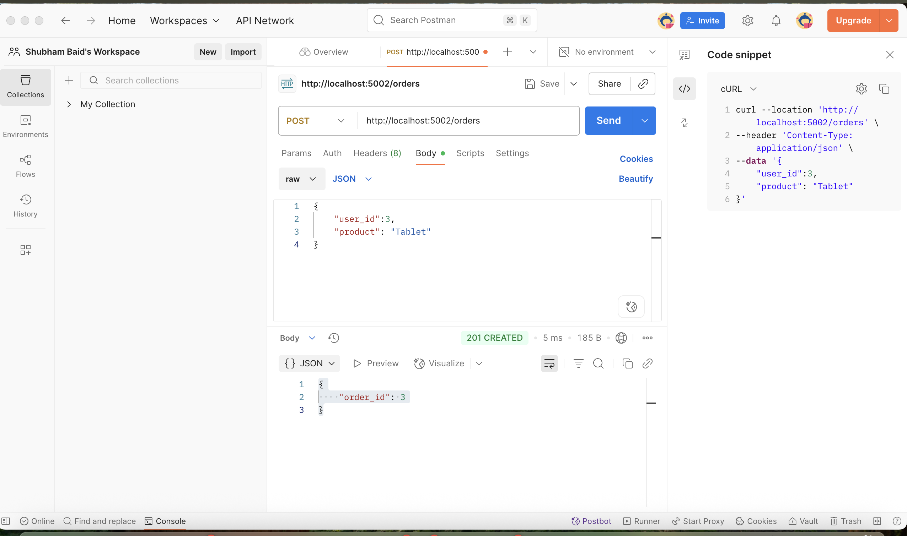
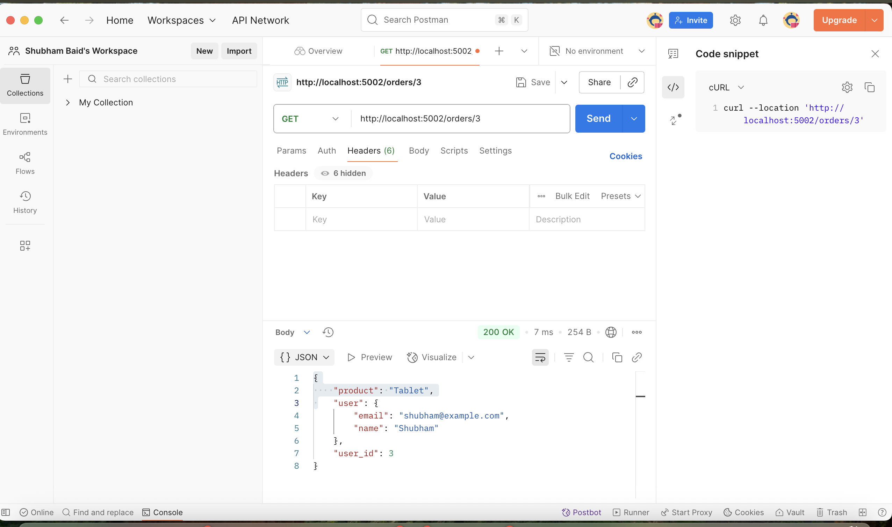

# Microservices Architecture Assignment

• Create a User: 

curl --location --request GET 'http://localhost:5001/users/' \
--header 'Content-Type: application/json' \
--data-raw '{
    "email": "candy@example.com",
    "name": "Candy"
}'

• Get a User: 

curl http://localhost:5001/users/3

• Create an Order: 

curl --location --request GET 'http://localhost:5002/orders' \
--header 'Content-Type: application/json' \
--data '{
    "user_id":3, 
    "product": "Tablet"
}'

• Get an Order: 

curl http://localhost:5002/orders/3

